# DSA

## C++ 覆盖率

[](https://mental1104.github.io/DataStructure/modules/cpp-coverage/)

| 平台 / 编译器 | C++11 | C++14 | C++17 | C++20 | C++23 |
| --- | --- | --- | --- | --- | --- |
| Linux / clang++ | [](https://mental1104.github.io/DataStructure/modules/cpp-coverage/) | [](https://mental1104.github.io/DataStructure/modules/cpp-coverage/) | [](https://mental1104.github.io/DataStructure/modules/cpp-coverage/) | [](https://mental1104.github.io/DataStructure/modules/cpp-coverage/) | [](https://mental1104.github.io/DataStructure/modules/cpp-coverage/) |
| Linux / g++ | [](https://mental1104.github.io/DataStructure/modules/cpp-coverage/) | [](https://mental1104.github.io/DataStructure/modules/cpp-coverage/) | [](https://mental1104.github.io/DataStructure/modules/cpp-coverage/) | [](https://mental1104.github.io/DataStructure/modules/cpp-coverage/) | [](https://mental1104.github.io/DataStructure/modules/cpp-coverage/) |
| macOS / clang++ | [](https://mental1104.github.io/DataStructure/modules/cpp-coverage/) | [](https://mental1104.github.io/DataStructure/modules/cpp-coverage/) | [](https://mental1104.github.io/DataStructure/modules/cpp-coverage/) | [](https://mental1104.github.io/DataStructure/modules/cpp-coverage/) | [](https://mental1104.github.io/DataStructure/modules/cpp-coverage/) |
| macOS / g++ | [](https://mental1104.github.io/DataStructure/modules/cpp-coverage/) | [](https://mental1104.github.io/DataStructure/modules/cpp-coverage/) | [](https://mental1104.github.io/DataStructure/modules/cpp-coverage/) | [](https://mental1104.github.io/DataStructure/modules/cpp-coverage/) | [](https://mental1104.github.io/DataStructure/modules/cpp-coverage/) |
| Windows / MSVC | [](https://mental1104.github.io/DataStructure/modules/cpp-coverage/) | [](https://mental1104.github.io/DataStructure/modules/cpp-coverage/) | [](https://mental1104.github.io/DataStructure/modules/cpp-coverage/) | [](https://mental1104.github.io/DataStructure/modules/cpp-coverage/) | [](https://mental1104.github.io/DataStructure/modules/cpp-coverage/) |

## 简介

本仓库主要涵盖《数据结构-邓俊辉》和 *Algorithm 4th* 中的代码:

参考资料：
+ Algorithms 4th: [Offical Website](https://algs4.cs.princeton.edu/home/)
+ Algorithms 4th: [Java Code](https://algs4.cs.princeton.edu/code/)
+ Algorithms 4th: [sample data](https://algs4.cs.princeton.edu/code/algs4-data.zip)
+ DSACPP: [Deng JunHui](https://dsa.cs.tsinghua.edu.cn/~deng/ds/dsacpp/)

本仓库基于官方的实现，将两套书籍中的代码精选数据结构和算法来实现。

## 如何使用

测试操作系统：macOS/Ubuntu 22.04    
测试编译器：g++/clang++  

```
git clone --recurse-submodules git@github.com:mental1104/DataStructure.git
```

编译：
```sql
cd DataStructure
mkdir build
cd build
cmake ..
make
```

### 运行测试

```sql
ctest
```

### 排序性能基准

运行命令（默认在 `build/bench/sort`）：`./sort_bench`

| Algorithm  | N     | Seconds |
|------------|-------|---------|
| Bubble     | 5000  | 0.0504  |
| Selection  | 5000  | 0.0203  |
| Insertion  | 5000  | 0.0239  |
| Shell      | 200000| 0.0527  |
| MergeTD    | 200000| 0.0253  |
| MergeBU    | 200000| 0.0239  |
| Quick      | 200000| 0.0194  |
| Quick3way  | 200000| 0.0281  |
| QuickBF    | 200000| 0.0208  |
| Heap       | 200000| 0.0412  |

说明：
- O(n²) 的冒泡/选择/插入只测了 5k 规模，避免拖慢整体用例。
- 快速排序族在随机数据上最快，归并（自顶向下、自底向上）紧随其后。
- Shell 与 Heap 更稳定但略慢，仍明显优于 O(n²) 算法。
- 所有用例都验证了排序结果有序。
- 想体现插入排序在“近乎有序”输入下接近线性的优势，可运行 `./sort_bench --shape almost --perturb 0.001`（默认构造 0.1% 相邻交换的有序数组，并把插入排序规模提升到 nlogn_size，方便与其他 n log n 算法对比）。
- 默认执行 `./sort_bench` 会依次跑随机、近乎有序、大量重复值三个数据块。第一块包含冒泡/选择，第二块起跳过这两个 O(n²) 算法；第三块起插入排序也退出（该场景看 Quick3way 在大量重复值下的优势）。可用 `--shape random|almost|dups|random,almost,dups` 等覆盖默认顺序。

## 数据结构-邓俊辉-demo演示

### 1 绪论

### 2 向量

[src](demo/vector/Vector.cpp)

```
./demo/vector/Vector
```

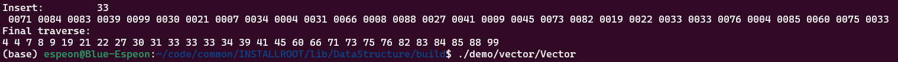

### 3 列表

[src](demo/list/List.cpp)

```
./demo/list/List
```
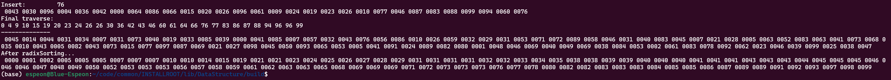

### 4.1 栈

[src](demo/stack/Stack.cpp)

```
./demo/stack/Stack
```

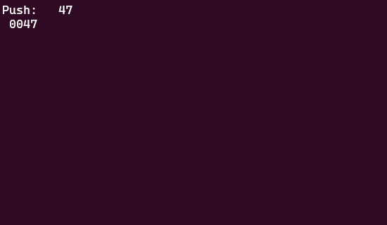

#### 八皇后

[src](demo/stack/Queen.cpp)

```
./demo/stack/Queen
```
通过回车触发：
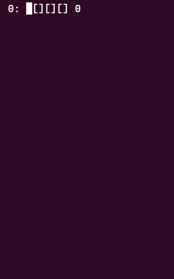

#### 迷宫寻径

[src](demo/stack/labyrinth.cpp)

```
cd demo/stack
./labyrinth
```

通过回车触发寻径：

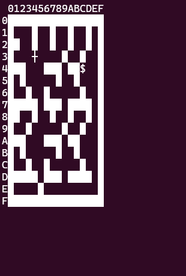

#### 表达式求值

[src](demo/stack/evaluate.cpp)

```
./demo/stack/evaluate
```


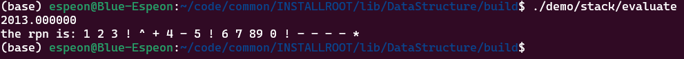

#### 括号匹配

[src](demo/stack/paren.cpp)

```
./demo/stack/paren
```

### 4.2 队列

[src](demo/queue/Queue.cpp)

```
./demo/queue/Queue
```

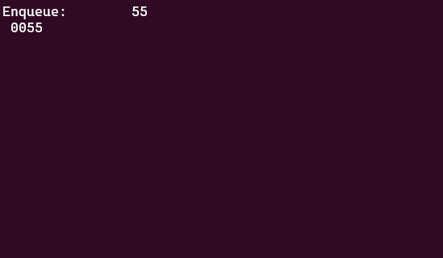

### 5 二叉树

[src](demo/bt/BinTree.cpp)

```
./demo/bt/BinTree
```
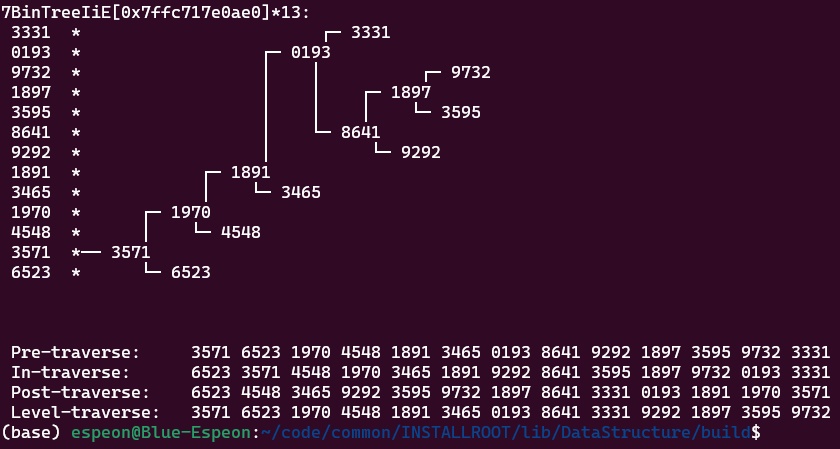

### 6 图

[src](demo/graph/GraphMatrix.cpp)

```
cd demo/graph
./GraphMatrix
```
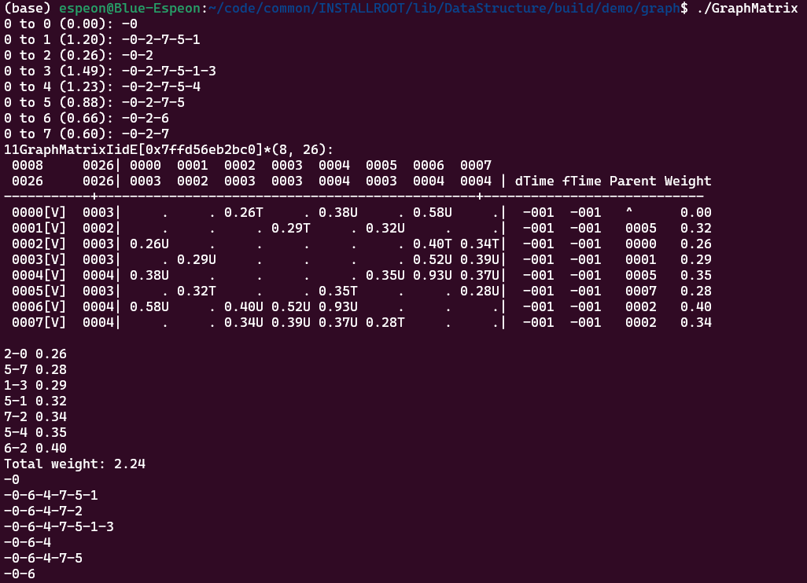

### 7 二叉搜索树

[src](demo/bst/BST.cpp)

```
./demo/bst/BST
```

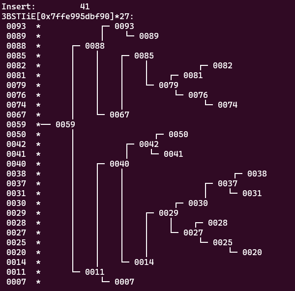

#### AVL树

[src](demo/bst/AVL.cpp)

```
./demo/bst/AVL
```

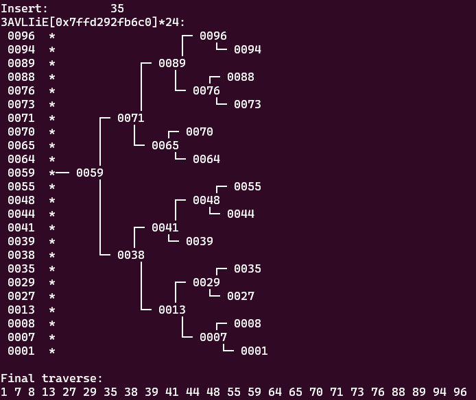

### 8 高级二叉搜索树

#### 性能评测

```
cd demo/bst
python3 benchmark.py
```

#### Splay树

[src](demo/bst/Splay.cpp)

```
./demo/bst/Splay
```

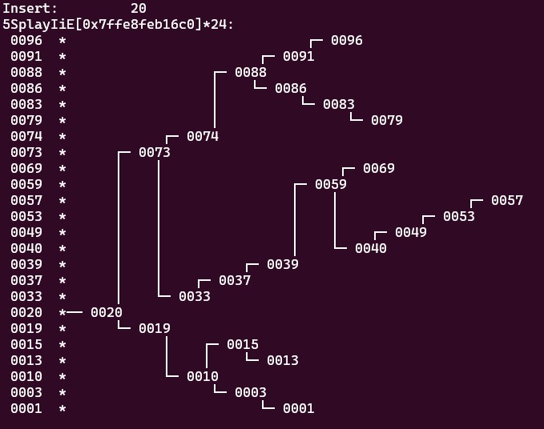

#### B-树

#### 红黑树

[src](demo/bst/RedBlack.cpp)

```
./demo/bst/RedBlack
```

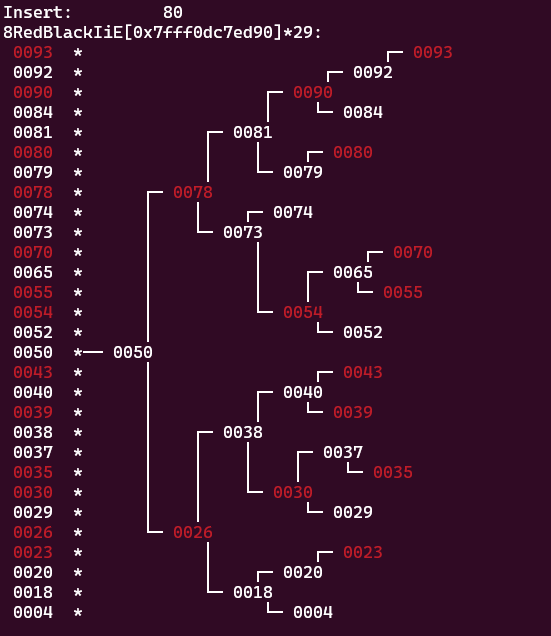

### 9 散列表

#### 哈希表-线性探测

[src](demo/bst/Hashtable.cpp)

```
./demo/bst/Hashtable
```


#### 哈希表-双向平方探测

[src](demo/bst/HashtableB.cpp)

```
./demo/bst/HashtableB
```

#### 跳跃表

[src](demo/bst/Skiplist.cpp)

```
./demo/bst/Skiplist
```

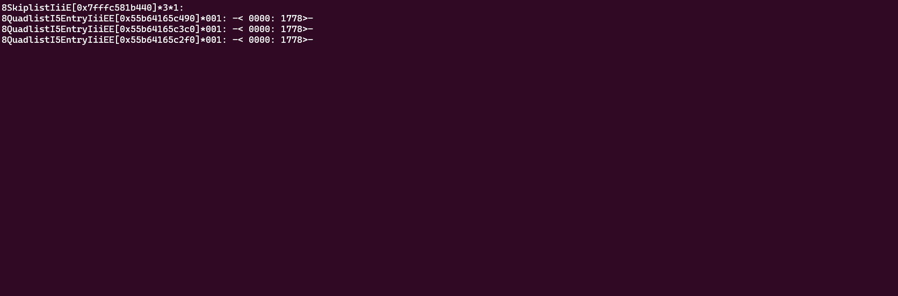

### 10 优先级队列

#### 堆

[src](demo/pq/Heap.cpp)

```
./demo/bst/Heap
```

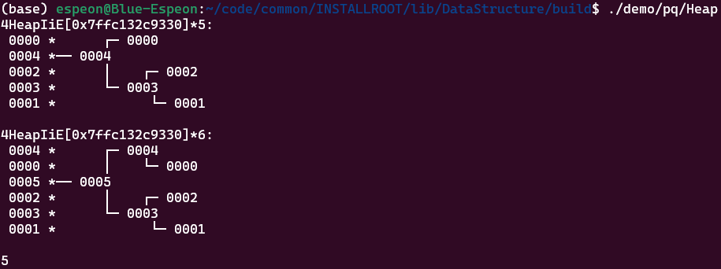

#### 左式堆

[src](demo/pq/LeftHeap.cpp)

```
./demo/bst/LeftHeap
```


### 11 串

### 12. 排序

#### 性能测试

```
cd demo/sort
python3 benchmark.py
```

## 算法4-demo演示

### 并查集

## 后续TODO
